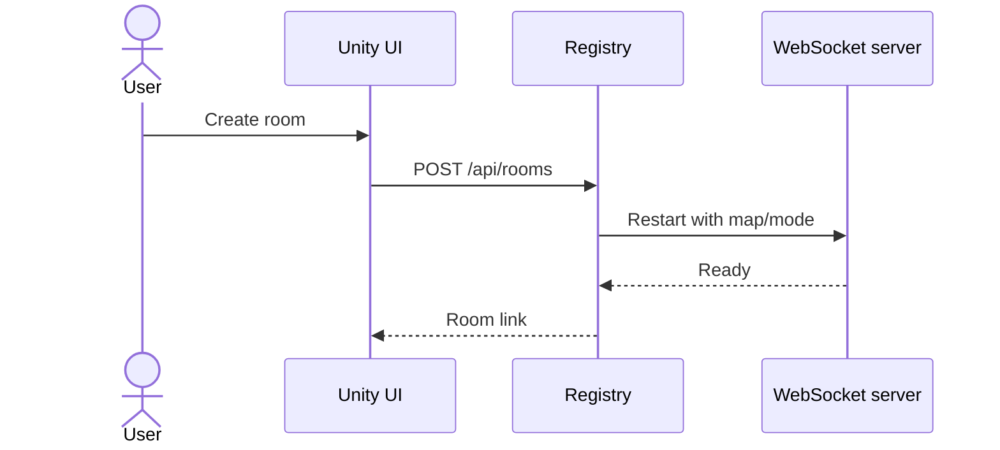

# Plan triển khai lại R2 diagrams

Ngày lập: 2026-06-21  
Nguồn hiện tại: `adds/PLAN/R2_DIAGRAMS/datn_R2_diagrams_2026-06-21.drawio`  
Output mong muốn: mỗi diagram là một file riêng, dễ mở, dễ export PNG/PDF, ít chữ và trực quan hơn.

## 1. Mục tiêu chỉnh sửa

1. Tách từng diagram thành từng file riêng.
2. Sơ đồ hệ thống, kiến trúc, data-flow, activity và deployment dùng draw.io.
3. Sequence diagram dùng Mermaid.
4. Mỗi khối chỉ giữ nhãn ngắn, tối đa 2-4 dòng.
5. Các nhóm liên quan đặt trong container cha/con giống mẫu `Clipboard Parsing API Architecture`.
6. Nội dung giải thích dài chuyển sang README/caption LaTeX, không nhồi vào hình.
7. Tên file export phải ổn định để đưa thẳng vào LaTeX.

## 2. Quy ước style mới

### 2.1. Draw.io

Áp dụng cho system/context, architecture, activity, data-flow, class, deployment.

Quy tắc:

- Nền sáng hoặc nền tối thống nhất, không trộn quá nhiều màu.
- Mỗi container cha có tiêu đề ngắn:
  - `client`
  - `unity runtime`
  - `mapf core`
  - `c++ solver`
  - `multiplayer backend`
  - `gcp production`
  - `ci/cd`
  - `evidence`
- Bên trong container chỉ đặt các block con liên quan.
- Mũi tên chỉ biểu diễn luồng chính, không vẽ mọi dependency nhỏ.
- Text trong node dùng danh từ/ngữ động từ ngắn: `Menu`, `MapLoader`, `Planner`, `Registry`, `WebSocket server`.
- Ghi chú dài như port, API path, class/file name chi tiết để trong README/caption.

Style gợi ý:

| Loại | Màu/shape | Ghi chú |
|---|---|---|
| Actor/client | Rounded rectangle | Browser, Native client, Student/player. |
| Container cha | Rectangle lớn, viền rõ | Nhóm logic như Unity runtime, GCP production. |
| Service/module | Rounded rectangle | Module xử lý chính. |
| Data/artifact | Document/folder | `.map`, CSV, WebGL artifact. |
| Decision | Diamond | Chỉ dùng cho activity diagram. |
| External dependency | Dashed border hoặc dashed arrow | Paper, model/resource ngoài runtime. |

### 2.2. Draw.io activity map / swimlane

Áp dụng riêng cho:

- `03_single_play_activity.drawio`
- `04_internet_host_join_activity.drawio`

Activity diagram phải vẽ theo mẫu swimlane giống hình tham khảo `Order payment activity map`, không dùng layout flow tự do.

Quy tắc layout:

- Có một khung ngoài bao toàn bộ diagram.
- Hàng đầu tiên là title nằm giữa, ví dụ `Single Play activity map`.
- Hàng thứ hai là header lane.
- Các lane là cột dọc, phân tách bằng đường thẳng.
- Mỗi lane đại diện cho một actor/system boundary rõ ràng.
- Node bắt đầu dùng filled circle.
- Node kết thúc dùng bullseye/final node.
- Activity dùng rounded rectangle, ít chữ.
- Decision dùng diamond, label nhánh đặt cạnh mũi tên.
- Mũi tên có thể đi qua lane nhưng phải ít giao cắt nhất có thể.
- Không dùng container màu lớn cho activity diagram; ưu tiên nền trắng, line đen/xám, giống tài liệu học thuật.
- Có thể thêm lane trống nếu cần cân bằng bố cục, nhưng không nhồi thông tin phụ.

Lane đề xuất:

| Diagram | Lane 1 | Lane 2 | Lane 3 | Lane 4 |
|---|---|---|---|---|
| `03_single_play_activity.drawio` | `Player` | `Menu/UI` | `Unity runtime` | `MAPF planner` |
| `04_internet_host_join_activity.drawio` | `Host` | `Guest` | `Registry` | `Game server` |

Style cụ thể:

| Thành phần | Style |
|---|---|
| Outer frame | White fill, dark gray stroke, 1-2 px |
| Lane separator | Straight vertical line, dark gray |
| Lane header | Plain text centered, small font |
| Activity node | Rounded rectangle, white fill, dark stroke |
| Decision node | Diamond, white fill, dark stroke |
| Start node | Filled black/dark circle |
| End node | Bullseye/final state |
| Arrow | Orthogonal connector, dark stroke, open/block arrow |

### 2.3. Mermaid sequence

Áp dụng cho mọi sequence diagram.

Quy tắc:

- Mỗi sequence diagram là một file `.mmd`.
- Dùng `sequenceDiagram`.
- Dùng `actor`, `participant`, `alt`, `opt`, `loop` khi cần.
- Mỗi message ngắn, ưu tiên tên hành động thay vì mô tả dài.
- Nếu cần chú thích, dùng `Note over`.
- Không đưa tên file C# dài vào message; tên file/module dài ghi trong README.

Template:



## 3. Cấu trúc thư mục đề xuất

Tạo folder mới, không ghi đè bộ R2 cũ ngay:

```text
adds/PLAN/R2_DIAGRAMS_V2/
  README_R2_DIAGRAMS_V2_2026-06-21.md
  drawio/
    01_system_context.drawio
    02_architecture_packages.drawio
    03_single_play_activity.drawio
    04_internet_host_join_activity.drawio
    07_mapf_data_flow.drawio
    08_pathfinding_class_diagram.drawio
    12_pibt_to_epibt_path.drawio
    13_backtest_workflow.drawio
    14_gcp_nginx_deployment.drawio
  mermaid/
    05_internet_create_room_sequence.mmd
    06_internet_ready_start_sequence.mmd
    09_astar_replan_sequence.mmd
    10_pibt_csharp_sequence.mmd
    11_pibt_tcp_epibt_sequence.mmd
  export/
    pdf/
    png/
```

Quy ước: `drawio/` và `mermaid/` là source; `export/` chỉ chứa file xuất ra sau khi mở bằng draw.io hoặc Mermaid CLI.

## 4. Danh sách diagram cần làm lại

| ID | File source mới | Loại | Nội dung chính | Cách làm gọn |
|---|---|---|---|---|
| 01 | `drawio/01_system_context.drawio` | Draw.io | Player, Unity client, GCP, registry, C++ solver, map data | Container: `client`, `unity runtime`, `external solver`, `production`. |
| 02 | `drawio/02_architecture_packages.drawio` | Draw.io | UI, map runtime, gameplay, MAPF, TCP, multiplayer, backtest, infra | Dùng container cha theo package, mỗi block con là module chính. |
| 03 | `drawio/03_single_play_activity.drawio` | Draw.io activity map | Main Menu -> Single Play -> map/mode -> scene -> gameplay -> result | Vẽ swimlane dọc theo mẫu payment activity map; lane `Player`, `Menu/UI`, `Unity runtime`, `MAPF planner`. |
| 04 | `drawio/04_internet_host_join_activity.drawio` | Draw.io activity map | Host/Join, create room, join link, lobby, ready, start | Vẽ swimlane dọc theo mẫu payment activity map; lane `Host`, `Guest`, `Registry`, `Game server`. |
| 05 | `mermaid/05_internet_create_room_sequence.mmd` | Mermaid sequence | UI -> registry `/api/rooms` -> systemd/helper -> WebSocket server -> room link | Dùng `alt ready / failed` nếu cần. |
| 06 | `mermaid/06_internet_ready_start_sequence.mmd` | Mermaid sequence | Host/guest ready, owner start, load gameplay, spawn tanks | Dùng `loop Players ready` và `alt all ready`. |
| 07 | `drawio/07_mapf_data_flow.drawio` | Draw.io | `.map` -> MapLoader -> scenario -> planner -> agent -> metric | Container `map runtime`, `mapf core`, `runtime output`. |
| 08 | `drawio/08_pathfinding_class_diagram.drawio` | Draw.io | Class diagram rút gọn MAPF | Giữ class box ngắn: tên lớp + 2-3 trách nhiệm, không liệt kê method dài. |
| 09 | `mermaid/09_astar_replan_sequence.mmd` | Mermaid sequence | Enemy -> MapLoader -> A* -> path -> move/shoot | Message ngắn: `WorldToCell`, `Find path`, `Follow`. |
| 10 | `mermaid/10_pibt_csharp_sequence.mmd` | Mermaid sequence | EnemyPIBT -> GridPIBTPathfinder -> PIBTPlanner -> path | Dùng `loop Replan tick`. |
| 11 | `mermaid/11_pibt_tcp_epibt_sequence.mmd` | Mermaid sequence | Unity -> TCP/Web relay -> C++ server -> PlannerSession -> action | Dùng `alt Native TCP / WebGL relay`. |
| 12 | `drawio/12_pibt_to_epibt_path.drawio` | Draw.io | Causal PIBT -> rotation issue -> MAO/Revisiting/IO -> EPIBT | Container `paper concept`, `game adaptation`, `server integration`. |
| 13 | `drawio/13_backtest_workflow.drawio` | Draw.io | Config -> job matrix -> run scene -> metrics -> CSV/chart -> Chương 5 | Đặt CSV/chart trong container `evidence`. |
| 14 | `drawio/14_gcp_nginx_deployment.drawio` | Draw.io | Browser/native, Nginx, registry, UDP server, WebSocket server, CI/CD | Container lớn `GCP VM`; con: `Nginx`, `registry`, `game services`, `artifacts`. |

## 5. Chi tiết refactor theo từng nhóm

### 5.1. Nhóm hệ thống và kiến trúc

Mục tiêu: giống mẫu tham khảo #1, có container rõ ràng.

Làm:

1. `01_system_context.drawio`
   - Container trái: `client`
   - Container giữa: `unity runtime`
   - Container phải: `production services`
   - Container dưới/phụ: `data & evidence`
   - Chỉ giữ các mũi tên: player -> Unity, Unity -> C++ solver, Unity -> registry, CI/CD -> GCP.

2. `02_architecture_packages.drawio`
   - Container cha: `client layer`, `runtime layer`, `algorithm layer`, `online layer`, `evaluation layer`.
   - Không viết file path trong node.
   - File path chuyển sang README.

### 5.2. Nhóm luồng sản phẩm

Mục tiêu: activity diagram rõ, ít chữ, theo đúng dạng activity map có swimlane như hình tham khảo.

Làm:

1. `03_single_play_activity.drawio`
   - Vẽ khung ngoài với title `Single Play activity map`.
   - Chia 4 lane dọc: `Player`, `Menu/UI`, `Unity runtime`, `MAPF planner`.
   - Dùng start node ở lane `Player`.
   - Chỉ 1 decision chính: `Algorithm?`.
   - Nhánh ngắn: `A*`, `PIBT`, `PIBT-TCP`.
   - End node ở lane `Player` hoặc `Unity runtime` sau khi hiển thị kết quả.
   - Không đưa tên file/class vào node; tên file để trong README/caption.

2. `04_internet_host_join_activity.drawio`
   - Vẽ khung ngoài với title `Multiplayer Internet activity map`.
   - Chia 4 lane dọc: `Host`, `Guest`, `Registry`, `Game server`.
   - Host: chọn map/mode -> create room -> lobby -> start.
   - Guest: nhập code/link -> resolve -> lobby -> ready.
   - Registry: tạo room -> trả link -> resolve session.
   - Game server: ready gate -> load scene -> gameplay.
   - Decision chính: `All ready?`.
   - Dùng nhánh `No` quay lại lobby, `Yes` đi tới start/gameplay.
   - Nếu có nhánh lỗi, dùng `Create failed` hoặc `Invalid room` nhưng không vẽ quá chi tiết.

### 5.3. Nhóm sequence

Mục tiêu: chuyển sang Mermaid để dễ sửa text và render lại.

Làm:

1. `05_internet_create_room_sequence.mmd`
   - Participants: `Host UI`, `InternetSessionClient`, `Registry`, `GCP helper`, `WebSocket server`.
   - Có `alt server ready / create failed`.

2. `06_internet_ready_start_sequence.mmd`
   - Participants: `Host`, `Guest`, `Lobby`, `Server`, `GameCoordinator`.
   - Có `loop players ready`.

3. `09_astar_replan_sequence.mmd`
   - Participants: `GridEnemyAgent`, `MapLoader`, `GridAStarPathfinder`, `Enemy runtime`.

4. `10_pibt_csharp_sequence.mmd`
   - Participants: `GridEnemyAgentPIBT`, `GridPIBTPathfinder`, `PIBTPlanner`, `Enemy runtime`.

5. `11_pibt_tcp_epibt_sequence.mmd`
   - Participants: `MapScenarioBootstrapPIBT_TCP`, `PIBTTcpClient/WebRelay`, `PibtTcpServer`, `PlannerSession`, `GridEnemyAgentPIBT_TCP`.
   - Có `alt Native TCP / WebGL relay`.
   - Có `loop tcp tick`.

### 5.4. Nhóm thuật toán và thực nghiệm

Mục tiêu: thuật toán rõ theo tầng, có EPIBT là lõi.

Làm:

1. `07_mapf_data_flow.drawio`
   - Container `input`, `map runtime`, `planner`, `agent runtime`, `metrics`.
   - Giảm text trong planner thành 4 block: `A*`, `PIBT C#`, `PIBT C++`, `EPIBT`.

2. `08_pathfinding_class_diagram.drawio`
   - Không dùng UML đầy đủ rườm rà.
   - Mỗi class box chỉ có:
     - tên lớp;
     - 2 trách nhiệm chính.

3. `12_pibt_to_epibt_path.drawio`
   - Trái: `Causal PIBT`
   - Giữa: `rotation issue`
   - Phải: `EPIBT core`
   - Dưới: `Unity/C++ integration`
   - Góc nhỏ: citation paper.

4. `13_backtest_workflow.drawio`
   - Flow ngang: config -> matrix -> runner -> metrics -> artifacts -> report.
   - Gộp CSV/HTML/PNG vào container `evidence`.

### 5.5. Nhóm deployment

Mục tiêu: GCP/Nginx dễ nhìn, không giống sơ đồ network rối.

Làm:

1. `14_gcp_nginx_deployment.drawio`
   - Container cha lớn: `GCP VM`
   - Con:
     - `Nginx`
     - `WebGL static`
     - `Registry`
     - `UDP server`
     - `WebSocket server`
     - `PIBT/EPIBT solver`
   - Ngoài container:
     - `Browser`
     - `Native client`
     - `GitHub Actions`
   - Mũi tên:
     - Browser -> Nginx -> WebGL static.
     - Browser -> WebSocket server.
     - Native -> UDP server.
     - Browser/Unity -> Registry.
     - Registry -> solver relay nếu dùng PIBT TCP.

## 6. Thứ tự triển khai đề xuất

| Bước | Việc làm | Output |
|---|---|---|
| D1 | Tạo folder `R2_DIAGRAMS_V2` và README manifest | Cấu trúc thư mục mới |
| D2 | Tạo 5 Mermaid sequence trước | `.mmd` render nhanh, dễ review |
| D3 | Tách 4 draw.io quan trọng nhất | `01`, `02`, `04`, `14` |
| D4 | Tạo các draw.io thuật toán/thực nghiệm | `07`, `08`, `12`, `13` |
| D5 | Tạo Single Play activity | `03` |
| D6 | Validate XML và Mermaid syntax | Báo cáo kiểm tra |
| D7 | Nếu có CLI phù hợp, export thử PNG/SVG/PDF | File trong `export/` |

Ưu tiên trước cho quyển:

1. `01_system_context.drawio`
2. `02_architecture_packages.drawio`
3. `04_internet_host_join_activity.drawio`
4. `11_pibt_tcp_epibt_sequence.mmd`
5. `12_pibt_to_epibt_path.drawio`
6. `14_gcp_nginx_deployment.drawio`

## 7. Tiêu chí hoàn thành

- Mỗi diagram có file riêng.
- Không còn file draw.io nhiều page là nguồn chính.
- Sequence diagram đều là `.mmd`.
- Draw.io system/deployment/data-flow có container cha/con rõ.
- Draw.io activity diagram dùng swimlane activity map nền trắng, không dùng container màu lớn.
- Activity diagram có layout activity map/swimlane đúng mẫu: outer frame, title bar, lane header, lane separator, start/end node, decision diamond.
- Text trong node ngắn, không tràn khối.
- Có README map giữa file source, file export và vị trí trong LaTeX.
- Có thể export từng diagram độc lập sang PNG/PDF.
- R1/R2 docs được cập nhật để trỏ sang `R2_DIAGRAMS_V2`.

## 8. Rủi ro và cách kiểm soát

| Rủi ro | Cách xử lý |
|---|---|
| Draw.io XML lỗi do ký tự đặc biệt | Validate XML sau mỗi file; escape `&`, `<`, `>`. |
| Chữ vẫn quá dài khi mở draw.io | Giữ node label ngắn; đưa diễn giải sang README/caption. |
| Mermaid render không đúng style mong muốn | Giữ sequence đơn giản; sau đó export SVG/PNG từ VS Code hoặc Mermaid CLI. |
| Quá nhiều diagram làm quyển dài | README phân loại chương chính/phụ lục. |
| Trùng lặp giữa activity và sequence | Activity mô tả workflow người dùng; sequence mô tả tương tác module/service. |

## 9. Kiểm tra sau triển khai

Lệnh kiểm tra dự kiến:

```powershell
# Validate XML draw.io
Get-ChildItem adds/PLAN/R2_DIAGRAMS_V2/drawio/*.drawio | ForEach-Object {
  [xml](Get-Content -Raw -Encoding UTF8 $_.FullName) | Out-Null
  Write-Host "XML OK:" $_.Name
}

# Liệt kê Mermaid files
Get-ChildItem adds/PLAN/R2_DIAGRAMS_V2/mermaid/*.mmd
```

Nếu có Mermaid CLI:

```powershell
mmdc -i adds/PLAN/R2_DIAGRAMS_V2/mermaid/05_internet_create_room_sequence.mmd `
     -o adds/PLAN/R2_DIAGRAMS_V2/export/png/05_internet_create_room_sequence.png
```

## 10. Ghi chú cho R3/R4

- R3 có thể bổ sung số liệu thật vào `13_backtest_workflow` hoặc caption, nhưng không nên sửa cấu trúc diagram nếu không cần.
- R4 chụp screenshot production rồi đặt cạnh `04_internet_host_join_activity` và `14_gcp_nginx_deployment` trong báo cáo.
- Khi đưa vào LaTeX, caption mới là nơi giải thích chi tiết port/API/file; diagram chỉ đóng vai trò trực quan hóa.
