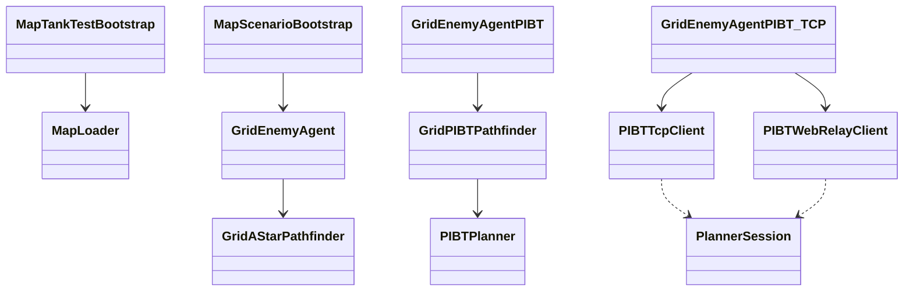

# Plan sửa R2 diagrams V2

Ngày lập: 2026-06-21  
Nguồn cần sửa: `adds/PLAN/R2_DIAGRAMS_V2/`  
Mục tiêu: sửa bộ sơ đồ R2 theo phản hồi mới về màu sắc, lỗi mở file architecture, class diagram và activity swimlane. Các sequence diagram hiện tại đang ổn nên không chỉnh nội dung.

## 1. Phạm vi sửa

### Cần sửa

1. Đổi màu toàn bộ file draw.io sang phong cách sáng, rõ ràng giống mẫu `Clipboard Parsing API Architecture`.
2. Sửa lỗi `02_architecture_packages.drawio` đang mở bị lỗi `d.setId is not a function`.
3. Chuyển `08_pathfinding_class_diagram` từ draw.io sang Mermaid class diagram.
4. Sửa `03_single_play_activity.drawio` và `04_internet_host_join_activity.drawio` để có swimlane rõ ràng.
5. Cập nhật README manifest để phản ánh đúng nguồn diagram mới.

### Không sửa

1. Không chỉnh nội dung các sequence diagram sau:
   - `mermaid/05_internet_create_room_sequence.mmd`
   - `mermaid/06_internet_ready_start_sequence.mmd`
   - `mermaid/09_astar_replan_sequence.mmd`
   - `mermaid/10_pibt_csharp_sequence.mmd`
   - `mermaid/11_pibt_tcp_epibt_sequence.mmd`
2. Không export PNG/PDF ở bước này nếu chưa được yêu cầu.
3. Không nhồi thêm mô tả dài vào diagram; phần giải thích để trong README hoặc caption LaTeX.

## 2. Quy chuẩn màu draw.io mới

Áp dụng cho các file draw.io còn active:

- `01_system_context.drawio`
- `02_architecture_packages.drawio`
- `03_single_play_activity.drawio`
- `04_internet_host_join_activity.drawio`
- `07_mapf_data_flow.drawio`
- `12_pibt_to_epibt_path.drawio`
- `13_backtest_workflow.drawio`
- `14_gcp_nginx_deployment.drawio`

Palette:

| Nhóm | Fill | Stroke | Font | Dùng cho |
|---|---|---|---|---|
| Client / Player | `#fff3e8` | `#ff7a1a` | `#1f2937` | Player, browser, Unity client input/output |
| Runtime / Service | `#f5f8fb` | `#718096` | `#1f2937` | Unity runtime, API/service layer, gameplay runtime |
| MAPF / Pipeline | `#eaf8ef` | `#19a85b` | `#1f2937` | A*, PIBT, EPIBT, planner pipeline |
| Online / Resource | `#eaf2ff` | `#3b74ff` | `#1f2937` | Registry, server, TCP/WebSocket relay, C++ solver |
| Evidence / Output | `#fff8dc` | `#d6a500` | `#1f2937` | Metrics, CSV, chart, screenshot placeholder |
| Risk / Decision | `#fff1f2` | `#f43f5e` | `#1f2937` | Decision/error node nếu cần |

Quy tắc trình bày:

- Nền trang trắng, không dùng dark theme.
- Container cha có fill pastel nhạt và viền rõ.
- Block con dùng nền trắng hoặc màu rất nhạt theo nhóm cha.
- Text trong node tối đa 1-3 dòng.
- Mũi tên chính dùng màu xám đậm `#374151`; mũi tên phụ hoặc external dependency dùng nét đứt.
- Xóa các màu tối cũ như `#161616`, `#111c2a`, `#102114`, `#231212`, `fontColor=#ffffff`.

## 3. Sửa file `02_architecture_packages.drawio`

Vấn đề: file architecture hiện mở trong draw.io bị lỗi `d.setId is not a function`.

Cách xử lý:

1. Không vá nhỏ trực tiếp trên XML cũ; regenerate file `02_architecture_packages.drawio` từ đầu để tránh giữ lại cấu trúc gây lỗi.
2. Dùng XML draw.io tối giản:
   - Một `<mxfile>`.
   - Một `<diagram>`.
   - Một `<mxGraphModel>`.
   - Root cell chuẩn `id="0"` và `id="1"`.
   - ID cell duy nhất, có prefix `arch_`.
3. Tránh shape/phần tử dễ gây lỗi:
   - Không dùng page/multipage lồng nhau.
   - Không dùng custom object.
   - Không dùng edge có parent lạ.
   - Không dùng ID trùng hoặc ID có ký tự bất thường.
4. Dùng rectangle/rounded rectangle cơ bản để mô tả package:
   - `client layer`
   - `runtime layer`
   - `algorithm layer`
   - `online layer`
   - `evaluation layer`
   - `deployment layer`
5. Sau khi regenerate, validate bằng XML parse và mở thử lại trong draw.io.

Nội dung rút gọn của architecture:

| Container | Block con |
|---|---|
| `client layer` | `Main menu`, `Single play`, `Multiplayer UI` |
| `runtime layer` | `Scene bootstrap`, `Map loader`, `Tank agent` |
| `algorithm layer` | `A*`, `PIBT C#`, `PIBT-TCP/EPIBT` |
| `online layer` | `Registry`, `WebSocket relay`, `C++ solver` |
| `evaluation layer` | `Backtest runner`, `Metrics`, `CSV/chart` |
| `deployment layer` | `Nginx`, `GCP VM`, `systemd services` |

## 4. Chuyển class diagram sang Mermaid

Vấn đề: class diagram bằng draw.io khó chỉnh, style chưa phù hợp và user yêu cầu chuyển sang Mermaid.

Cách xử lý:

1. Tạo file mới:
   - `adds/PLAN/R2_DIAGRAMS_V2/mermaid/08_pathfinding_class_diagram.mmd`
2. Cập nhật README để `08_pathfinding_class_diagram` trỏ sang Mermaid.
3. Đánh dấu file cũ `drawio/08_pathfinding_class_diagram.drawio` là legacy/superseded, hoặc xóa ở bước implement nếu không còn cần giữ lịch sử.
4. Class diagram dùng `classDiagram`, giữ ít class và ít member.

Class nên có:

| Nhóm | Class |
|---|---|
| Map/runtime | `MapLoader`, `MapTankTestBootstrap`, `MapScenarioBootstrap` |
| Agent | `GridEnemyAgent`, `GridEnemyAgentPIBT`, `GridEnemyAgentPIBT_TCP` |
| Planner local | `GridAStarPathfinder`, `GridPIBTPathfinder`, `PIBTPlanner` |
| Planner remote | `PIBTTcpClient`, `PIBTWebRelayClient`, `PlannerSession` |

Quan hệ chính:



Quy tắc Mermaid:

- Mỗi class chỉ ghi 1-3 member thật sự cần.
- Không đưa full file path vào class.
- Không đưa quá nhiều quan hệ phụ.
- Nếu cần giải thích thêm, ghi trong README/caption.

## 5. Sửa activity diagram có swimlane

Vấn đề: activity diagram hiện thiếu đường swimlane khi mở trong draw.io. Khả năng cao do separator đang dùng shape `line` dạng vertex nên render không ổn định.

Cách xử lý chung:

1. Regenerate hai activity diagram bằng layout activity map.
2. Không dùng `style=line` vertex cho separator.
3. Dùng lane background là rectangle trắng có viền hoặc dùng thin rectangle làm separator.
4. Thứ tự layer:
   - Outer frame.
   - Title row.
   - Lane background/header.
   - Activity node.
   - Connector.
5. Lane background đặt `connectable=0;movable=0;resizable=0;`.
6. Mũi tên dùng connector orthogonal, stroke `#374151`.
7. Decision diamond dùng nền trắng, stroke xám đậm.

### 5.1. `03_single_play_activity.drawio`

Title: `Single Play activity map`

Lane:

| Lane | Vai trò |
|---|---|
| `Player` | Chọn chế độ, chọn bản đồ, xem kết quả |
| `Menu/UI` | Điều hướng menu, gửi cấu hình chơi |
| `Unity runtime` | Load scene, spawn map/tank, chạy gameplay |
| `MAPF planner` | Chọn A*/PIBT/PIBT-TCP, trả path/action |

Luồng tối thiểu:

1. Start ở `Player`.
2. `Choose Single Play`.
3. `Select map/mode`.
4. `Load scene`.
5. Decision `Planner?`.
6. Nhánh `A*`, `PIBT`, `PIBT-TCP`.
7. `Return path/action`.
8. `Run match`.
9. `Show result`.
10. End.

### 5.2. `04_internet_host_join_activity.drawio`

Title: `Multiplayer Internet activity map`

Lane:

| Lane | Vai trò |
|---|---|
| `Host` | Tạo phòng, chờ lobby, start match |
| `Guest` | Mở link/code, join lobby, ready |
| `Registry` | Create room, resolve session, quản lý trạng thái room |
| `Game server` | Khởi tạo room, kiểm tra ready, load gameplay |

Luồng tối thiểu:

1. Start ở `Host`.
2. `Choose map/mode`.
3. `Create room`.
4. `Room ready`.
5. `Open room link`.
6. `Resolve session`.
7. `Join lobby`.
8. `Wait in lobby`.
9. Decision `All ready?`.
10. Nhánh `No` quay lại lobby.
11. Nhánh `Yes` đi tới `Start match`.
12. `Load gameplay`.
13. End.

## 6. Cập nhật README và manifest

Cập nhật `adds/PLAN/R2_DIAGRAMS_V2/README_R2_DIAGRAMS_V2_2026-06-21.md`:

1. Draw.io active còn 8 file:
   - `01_system_context.drawio`
   - `02_architecture_packages.drawio`
   - `03_single_play_activity.drawio`
   - `04_internet_host_join_activity.drawio`
   - `07_mapf_data_flow.drawio`
   - `12_pibt_to_epibt_path.drawio`
   - `13_backtest_workflow.drawio`
   - `14_gcp_nginx_deployment.drawio`
2. Mermaid active thành 6 file:
   - `05_internet_create_room_sequence.mmd`
   - `06_internet_ready_start_sequence.mmd`
   - `08_pathfinding_class_diagram.mmd`
   - `09_astar_replan_sequence.mmd`
   - `10_pibt_csharp_sequence.mmd`
   - `11_pibt_tcp_epibt_sequence.mmd`
3. Ghi chú rõ:
   - Sequence diagram không đổi nội dung trong đợt sửa này.
   - Class diagram đã chuyển sang Mermaid.
   - `drawio/08_pathfinding_class_diagram.drawio` nếu còn tồn tại chỉ là legacy.

## 7. Kiểm tra sau khi implement

### 7.1. Kiểm tra draw.io XML

Chạy XML parse cho toàn bộ draw.io:

```powershell
Get-ChildItem adds/PLAN/R2_DIAGRAMS_V2/drawio -Filter *.drawio |
  ForEach-Object {
    [xml]$xml = Get-Content $_.FullName -Raw -Encoding UTF8
    "$($_.Name): XML_OK"
  }
```

### 7.2. Kiểm tra không còn màu tối cũ

```powershell
Select-String -Path adds/PLAN/R2_DIAGRAMS_V2/drawio/*.drawio `
  -Pattern '#161616|#111c2a|#102114|#231212|fontColor=#ffffff'
```

Kỳ vọng: không có kết quả.

### 7.3. Kiểm tra file `02`

1. XML parse pass.
2. Mở được bằng diagrams.net/draw.io, không còn lỗi `d.setId is not a function`.
3. Bố cục có container cha/con và ít chữ.

### 7.4. Kiểm tra activity swimlane

1. `03_single_play_activity.drawio` có đủ 4 lane dọc.
2. `04_internet_host_join_activity.drawio` có đủ 4 lane dọc.
3. Lane separator hiển thị rõ trong draw.io.
4. Title row và lane header row giống dạng activity map tham khảo.

### 7.5. Kiểm tra Mermaid

1. Có file `mermaid/08_pathfinding_class_diagram.mmd`.
2. File bắt đầu bằng `classDiagram`.
3. Sequence diagram cũ không bị thay đổi nội dung.

## 8. Thứ tự thực hiện đề xuất

1. Tạo Mermaid class diagram `08_pathfinding_class_diagram.mmd`.
2. Regenerate `02_architecture_packages.drawio` bằng XML tối giản.
3. Regenerate hai activity diagram bằng swimlane rectangle ổn định.
4. Recolor các draw.io còn lại theo palette sáng.
5. Cập nhật README manifest.
6. Chạy validation XML, kiểm tra màu tối cũ và rà lại danh sách file active.
7. Mở thủ công `02`, `03`, `04` trong draw.io để xác nhận lỗi render đã hết.

## 9. Tiêu chí hoàn thành

Đợt sửa R2.1 được xem là xong khi:

1. `02_architecture_packages.drawio` mở được trong draw.io.
2. Tất cả draw.io dùng palette sáng, rõ container cha/con.
3. Activity diagram có swimlane thật sự hiển thị được.
4. Class diagram nằm ở Mermaid, không còn phụ thuộc vào draw.io.
5. Sequence diagram không bị sửa nội dung.
6. README liệt kê đúng 8 draw.io active và 6 Mermaid active.
7. Validation command không báo lỗi XML hoặc màu tối cũ.
