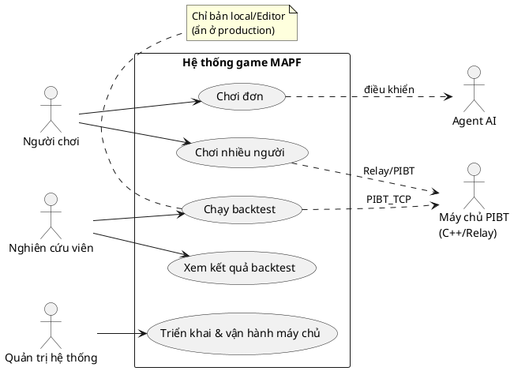

# Kế hoạch bổ sung Use Case + biểu đồ Use Case cho Chương 2 — 2026-06-25

Nguồn báo cáo: `adds/report/20225808_DuongQuangDong_2025.2/`
Tham chiếu code: nhánh **`networking-gcp`** (`f0cf8aa`, "fix: ui") — nhánh có đầy đủ multiplayer LAN/Internet/Relay + hạ tầng GCP, mới nhất so với nhánh report.

## Mục tiêu
1. Chương 2 hiện **chưa có biểu đồ use case thật** — mục §2.2.1 đặt tên "Biểu đồ use case tổng quan" nhưng lại chèn *activity diagram*. Cần bổ sung biểu đồ use case đúng nghĩa.
2. Liệt kê use case **đúng theo project** (bám code `networking-gcp`), không bịa.
3. Đưa use case **chơi đơn (single) và chơi nhiều người (multiple)** vào **chính thức Chương 2**, không để riêng ở Phụ lục.
4. Vì use case nhiều → làm **một biểu đồ tổng quan** rồi **bóc tách** thành các biểu đồ con theo nhóm.
5. Chốt **công cụ vẽ** use case (không dùng mermaid — mermaid không hỗ trợ use case diagram).
6. Ảnh Chương 2 chèn **PNG** (cropped), tránh chèn **PDF** gây nhiều khoảng trống.

---

## 1. Công cụ vẽ use case — khuyến nghị

Mermaid **không có** sơ đồ use case (chỉ flowchart hack được, xấu) → loại. Ba lựa chọn thực sự:

| Công cụ | Kiểu | Khớp ảnh mẫu | PNG cropped | Ai vẽ |
|---|---|---|---|---|
| **PlantUML** (khuyến nghị) | Text `.puml` | Tốt (actor/usecase/`rectangle` boundary/`<<extend>>`) | Có (PNG tự cắt sát) | Tôi viết source, bạn render |
| draw.io | GUI `.drawio` | Rất sát (đã dùng sẵn trong repo `adds/PLAN/R2_DIAGRAMS_V2/drawio/`) | Có (Export PNG, *Selection only / Crop*) | Vẽ tay |
| Astah | GUI | Sát (ảnh mẫu trông giống Astah/VP) | Có | Vẽ tay (phương án dự phòng của bạn) |

**Khuyến nghị: PlantUML** vì (i) đúng chuẩn UML use case, có sẵn `actor / usecase / rectangle "System Boundary" / .> <<extend>> / .> <<include>>`; (ii) text nên tôi tạo và chỉnh nhanh, version control được như mermaid hiện có; (iii) **xuất PNG được cắt sát mép** → giải quyết luôn vấn đề khoảng trống. Render bằng: extension *PlantUML* trong VS Code (Alt+D), hoặc `plantuml -tpng *.puml`, hoặc server `plantuml.com`.

Nếu bạn muốn giống hệt ảnh mẫu (màu kem, frame "uc Use Cases") thì dùng **draw.io** (đã có trong toolchain) hoặc **Astah**. Tôi sẽ chuẩn bị source PlantUML trước; nếu bạn thích GUI thì dùng nó làm bản phác để vẽ lại.

### Mẫu PlantUML cho biểu đồ tổng quan (để bạn đánh giá ngay)


---

## 2. Tác nhân (Actors) — theo code thực

- **Người chơi (Player)** — chơi đơn và nhiều người; gồm hai vai khi multiplayer: **Chủ phòng (Host)** và **Người tham gia (Client)**.
- **Nghiên cứu viên (Researcher)** — cấu hình/chạy/xem backtest; **chỉ ở bản local/Editor** (ẩn ở production).
- **Quản trị hệ thống / DevOps (Admin)** — triển khai relay/PIBT server lên GCP (`infra/`, `services/`).
- **Agent AI (Enemy)** — tác nhân hệ thống, do MAPF điều khiển.
- **Máy chủ PIBT (C++ TCP / Relay cloud)** — tác nhân ngoài (`PIBTTcpClient`, `PIBTWebRelayClient`, `RelayManager`).

---

## 3. Danh mục Use Case (tổng quan → bóc tách), kèm nguồn code

### Tổng quan (1 biểu đồ → §2.2): 5 use case mức cao
Chơi đơn · Chơi nhiều người · Chạy backtest (local-only) · Xem kết quả · Triển khai & vận hành.

### Nhóm A — Chơi đơn (Single Play) → §2.3, biểu đồ `uc_singleplay.png`
| ID | Use case | Nguồn code |
|---|---|---|
| A1 | Chọn bản đồ (.map) | `MenuViewBootstrap` (PrefKeyMapFile), `MapLoader` |
| A2 | Chọn thuật toán AI (A*/PIBT/PIBT_TCP) `<<include>>` | `MenuViewBootstrap` (PrefKeyAlgorithm), `BacktestMode` |
| A3 | Chọn mẫu xe tăng (skin, có loại khoá) | `MenuViewBootstrap.TankVariant` |
| A4 | Điều khiển xe tăng (di chuyển/xoay tháp/bắn) | `PlayerInput`, `TankController`, `TankMover`, `Turret` |
| A5 | Bảo vệ Eagle & kết thúc ván (thắng/thua) | `MapScenarioBootstrap`, `MapWinController`, `MapGameOverController`, `Damagable` |
| A6 | Tạm dừng → Tiếp tục (RESUME) / Quay lại Menu (MENU) | `PauseMenuController` (chỉ 2 nút này, **không** có cài đặt/âm thanh) |

### Nhóm B — Chơi nhiều người (Multiplayer) → §2.3, biểu đồ `uc_multiplayer.png`
*Tách rõ LAN vs Internet để làm nổi bật "single vs multiple".*
| ID | Use case | Nguồn code |
|---|---|---|
| B1 | Tạo phòng LAN (Host) | `LanLobbyController` (Screen.Hosting, _btnHost), `LanSessionManager`, `LanNetworkBridge` |
| B2 | Dò tìm & tham gia phòng LAN | `LanDiscovery`, `LanClientView`, `LanLobbyController` (Joining) |
| B3 | Phòng chờ: sẵn sàng (Ready) + Chủ phòng Bắt đầu | `LanLobbyController` (_btnReadyLobby, _btnStartLobby/RequestStartServerRpc) |
| B4 | Tạo phòng Internet (mã phòng + joinUrl + webUrl) | `InternetSessionClient.CreateRoomResponse`, `RelayManager.CreateRoomAsync` |
| B5 | Tham gia bằng mã phòng / URL | `InternetSessionClient` (lookup), `RelayManager.JoinRoomAsync/IsJoinCode`, `InternetJoinParser` |
| B6 | Sao chép mã phòng (WebGL) | `WebClipboard` |
| B7 | Chơi qua Relay / endpoint Web (WebGL) | `RelayManager`, `PIBTWebRelayClient`, `NetworkTransportMode`, webHost/webTransport |
| B8 | Đồng bộ trạng thái (tank/đạn/Eagle) | `LanGameCoordinator`, `NetworkManagerFactory` (Fish-Net) |
| B9 | Số agent theo số người chơi (hệ số nhân) | `LanLobbyController.ShowAndJoin(enemyMultiplier)`, `MapScenarioBootstrap` |
| B10 | Rời phòng / Huỷ / xử lý mất kết nối | `LanLobbyController` (_btnCancel), `JoinApprovalPayload`, handle-cancel (commits gần đây) |

### Nhóm C — (ĐÃ BỎ) Cấu hình & cá nhân hóa
**Sửa theo phản hồi:** hiện **chưa có** chức năng lưu/điều chỉnh âm thanh. Pause menu chỉ có
**Tiếp tục (RESUME)** và **Quay lại Menu (MENU)** → đã gộp vào **A6**, không tách nhóm riêng.
Việc ghi nhớ lựa chọn map/thuật toán/skin (`MenuViewBootstrap` PlayerPrefs) chỉ là *lưu nội bộ*,
không phải use case người dùng → không liệt kê và không vẽ.

### Nhóm D — Backtest (Researcher) → §2.3, biểu đồ `uc_backtest.png`
> **Chỉ có ở bản local/Editor.** Nút BACKTEST bọc trong `#if UNITY_EDITOR` (`MenuViewBootstrap`
> dòng 282–288) → **ẩn hoàn toàn ở production** (WebGL/standalone). Researcher chỉ thao tác trong
> môi trường phát triển. Cần ghi rõ ràng buộc này trong §2.3.3 và trên biểu đồ (note).
| ID | Use case | Nguồn code |
|---|---|---|
| D1 | Cấu hình backtest (map × algo × rep, chướng ngại động, số agent) | `Backtest/BacktestConfigUI`, `BacktestMode` |
| D2 | Chạy backtest tự động | `Backtest/BacktestRunner`, `DynamicObstacleSpawner` |
| D3 | Xem kết quả (CSV/HTML chart) | `Backtest/BacktestResultChart`, `Tools/backtest_plot_report.py` |

### Nhóm E — Triển khai & vận hành (DevOps) → Phụ lục (giữ ở phụ lục)
| ID | Use case | Nguồn code |
|---|---|---|
| E1 | Triển khai PIBT/relay server lên GCP | `infra/`, `services/`, `adds/PLAN/.../14_gcp_nginx_deployment.drawio` |
| E2 | Cấu hình endpoint/registry (nginx) | `NetworkEndpointConfig`, `services/` |
| E3 | Chạy dedicated server | `DedicatedServerBootstrap`, `NetworkLaunchArgs` |

---

## 4. Tái cấu trúc Chương 2

- **§2.2 Tổng quan chức năng**
  - §2.2.1 **Biểu đồ use case tổng quan** → thay activity diagram bằng **`uc_overview.png`** (6 UC mức cao + 5 actor). *Sửa chỗ đặt nhầm tên hiện tại.*
  - §2.2.2 Chuyển hai activity diagram (single/internet) sang mục **"Luồng hoạt động"** riêng (giữ nội dung, chỉ đổi nhãn + đổi sang PNG).
- **§2.3 Đặc tả chức năng** (đưa single + multiplayer vào chính thức):
  - §2.3.1 **Chơi đơn**: `uc_singleplay.png` + bảng đặc tả UC1 (giữ), thêm A2/A4/A5 rút gọn.
  - §2.3.2 **Chơi nhiều người (LAN + Internet)**: `uc_multiplayer.png` + **chuyển UC2 từ Phụ lục B vào đây**, bổ sung đặc tả tạo/tham gia phòng Internet + Relay (B4/B5/B7).
  - §2.3.3 **Backtest** (*ghi rõ: chỉ local/Editor, ẩn ở production*): `uc_backtest.png` + bảng UC4 (giữ) + UC3.
- **§2.4 Yêu cầu phi chức năng**: giữ.
- **Phụ lục B**: giữ UC5 (xem kết quả) + bổ sung nhóm E (DevOps/triển khai) — phần dài, ít người chấm cần xem chi tiết.

> Lưu ý số hiệu UC: hiện báo cáo dùng UC1–UC5. Đề xuất **đánh số lại theo nhóm** (A/B/C/D/E như trên) hoặc giữ UC1–UC5 và thêm UC6+ cho phần mới. Cần bạn chốt (xem mục Quyết định).

---

## 5. Xử lý hình ảnh (PNG, hết khoảng trống)

- Tất cả biểu đồ use case mới **xuất PNG cắt sát mép**: PlantUML PNG tự crop; draw.io chọn *Export → PNG → Selection Only / Crop*; Astah *Export Image* vùng chọn.
- Độ phân giải ≥ **150–200 dpi** (PlantUML: `skinparam dpi 200`) để in nét.
- Mẫu chèn:
  ```latex
  \begin{figure}[htbp]
    \centering
    \includegraphics[width=0.9\textwidth]{Hinhve/uc_overview.png}
    \caption{Biểu đồ use case tổng quan của hệ thống}
    \label{fig:uc_overview}
  \end{figure}
  ```
- **Hai activity diagram cũ** (`activity_single_play.pdf`, `activity_internet.pdf`) đang gây khoảng trống: re-export sang **PNG cropped** rồi đổi `\includegraphics`. (Nếu buộc giữ PDF: dùng `\includegraphics[trim=L B R T,clip]{}` nhưng PNG đơn giản hơn.)
- File PNG đặt trong `Hinhve/`; source `.puml` đặt trong `adds/PLAN/R2_DIAGRAMS_V2/plantuml/` (thư mục mới, song song drawio/mermaid).

---

## 6. Sản phẩm bàn giao
1. Source PlantUML: `uc_overview.puml`, `uc_singleplay.puml`, `uc_multiplayer.puml`, `uc_backtest.puml` (+ `uc_deploy.puml` cho Phụ lục).
2. PNG render tương ứng trong `Hinhve/`.
3. Sửa `Chuong/2_Khao_sat.tex` (tái cấu trúc §2.2/§2.3, chèn biểu đồ, đưa UC2 từ phụ lục vào).
4. Sửa `Chuong/Phu_luc_B.tex` (giữ UC5, thêm nhóm E DevOps).
5. Build lại `DoAn.pdf`, kiểm tra hình không tràn/không thừa khoảng trống.

## 7. Quyết định cần bạn chốt
1. **Công cụ**: PlantUML (tôi viết source) ✔ khuyến nghị — hay bạn tự vẽ draw.io/Astah, tôi chỉ cung cấp danh sách + bố cục?
2. **Đánh số UC**: giữ UC1–UC5 rồi thêm UC6+ , hay đánh lại theo nhóm A–E?
3. **Phạm vi đưa vào chính thức Chương 2**: A (single) + B (multiplayer) + D (backtest, ghi rõ local-only); nhóm C đã bỏ; E (DevOps) để Phụ lục — đồng ý không?
4. **Mức chi tiết đặc tả**: mỗi UC một bảng đầy đủ (luồng chính/phụ/điều kiện) hay chỉ các UC trọng tâm có bảng, còn lại liệt kê trong biểu đồ?
